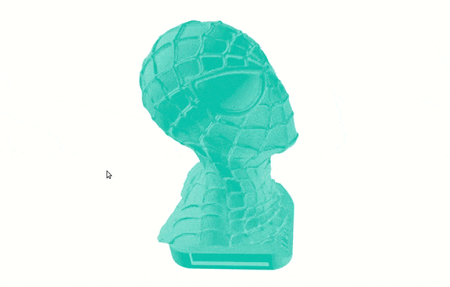

# react-stl-viewer

React component for visualizing STLs using Three.js.

<p align="center">
    
</p>

## Install

```shell
npm install --save react-stl-viewer
```
or
```shell
yarn install react-stl-viewer
```

## Usage

```js
import React from 'react';
import ReactDOM from 'react-dom';
import {StlViewer} from "react-stl-viewer";

const url = "https://storage.googleapis.com/ucloud-v3/ccab50f18fb14c91ccca300a.stl"

const style = {
    top: 0,
    left: 0,
    width: '100vw',
    height: '100vh',
}

function App() {
    return (
        <StlViewer
            style={style}
            url={url}
        />
    );
}

ReactDOM.render(<App />, document.getElementById('root'));
```

## Props

| Prop                       | Type                       | Required     | Notes                                                                                                                                                                                       |
| ----------------------     | :------------------------: | :----------: | :----------------------------------------------------------:                                                                                                                                |
| `url`                      | `string`                   | `?true`      | url of the Stl file, required if no "file" parameter is specified |
| `file`                     | `string or File`           | `?true`      | string or File object, required if no "url" parameter is specified |
| `color`                    | `string`                   | `false`      | (default "grey") model color |
| `shadows`                  | `boolean`                  | `false`      | render shadows projected by the model on the ground |
| `extraHeaders`             | `Record<string, string>`   | `false`      | custom headers for making the http query |
| `onFinishLoading`          | `(ev: LoadingFinishedEvent) => any`| `false`| callback triggered when Stl is fully loaded |
| `onError`                  | `(err: Error) => any`      | `false`      | callback triggered when an error occurred while loading Stl|
| `canvasId`                 | `string`                   | `false`      | id of the canvas element used for rendering the model |
The component also accepts ```<div/>``` props
